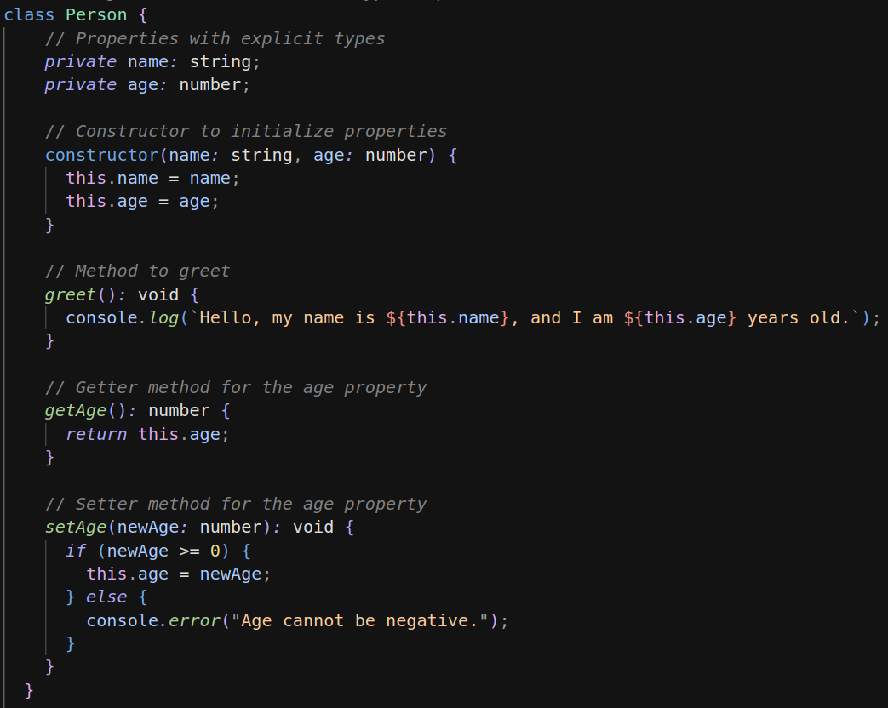

# VSCode Theme Extension - Lunar Dark Theme

## Description

A beautiful and comfortable theme to enhance your programming experience

## Features

- **Eye-Friendly Colors**: Thoughtfully chosen color schemes to ensure a comfortable and productive coding experience.

- **Versatility**: Suitable for a wide range of programming languages and file types.

## Installation

1. Launch Visual Studio Code.
2. Go to Extensions (Ctrl+Shift+X).
3. Search for "Lunar Dark Theme".
4. Click Install to apply the theme.
5. Choose the Lunar Dark Theme in the Color Theme picker.

## Screenshots

*Caption: Code editor with Lunar Dark Theme.*

## Contribution

If you have suggestions, issues, or want to contribute, feel free to visit the [GitHub repository](https://github.com/Pedro-Arthur/lunar-dark-theme/).

## License

This theme is released under the [MIT License](LICENSE).

---

Enjoy coding with the Lunar Dark Theme! 🚀
